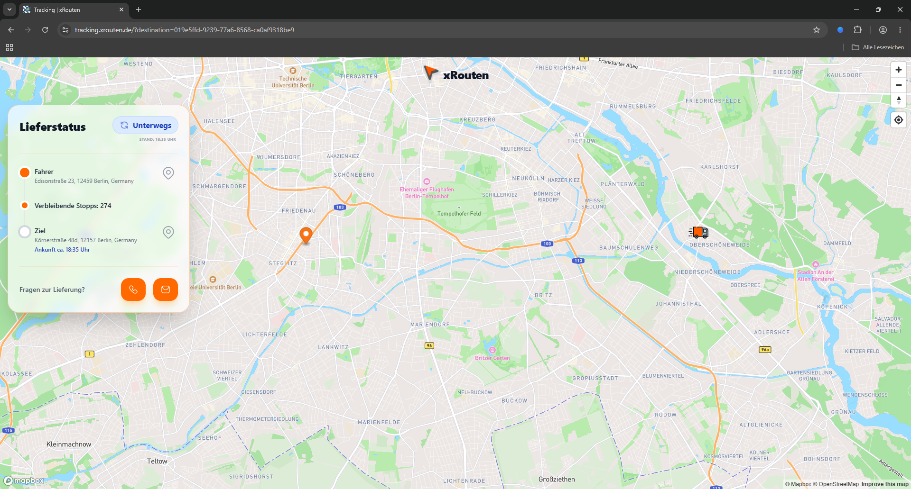
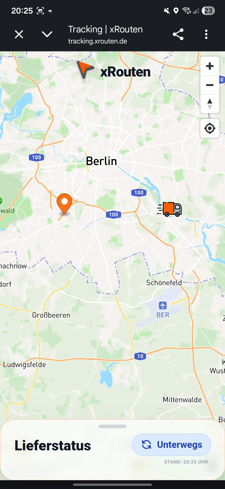
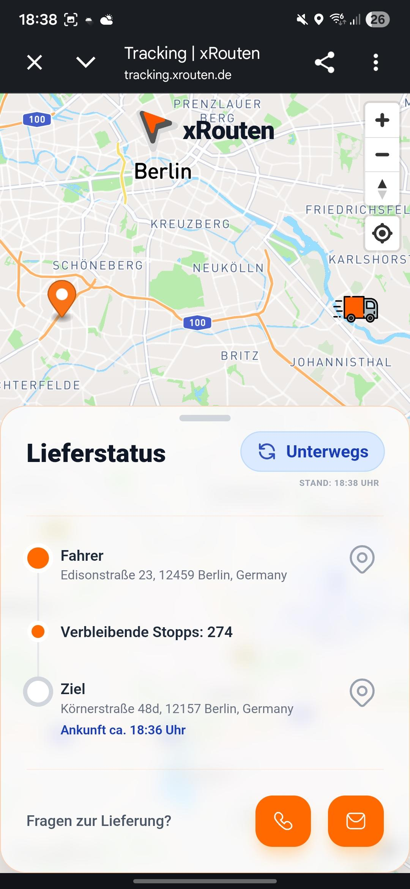
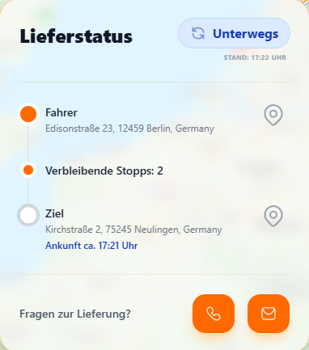
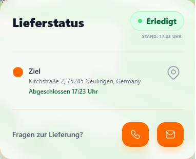
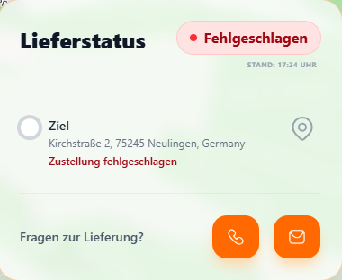
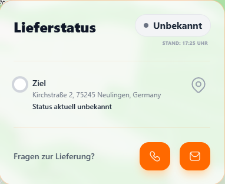

# xRoutenTracking

Eine moderne Web-Anwendung zur Echtzeit-Verfolgung von Routen und Lieferungen. Das Projekt nutzt Vue 3, Vite und Mapbox GL JS, um Lieferstatus und Fahrzeugpositionen auf einer interaktiven Karte darzustellen.

## 🚀 Features

- **Interaktive Karte**: Visualisierung von Start- und Zielpunkten sowie der aktuellen Route mittels Mapbox GL JS.
- **Echtzeit-Updates**: Automatisches Polling der Tracking-Daten alle 5 Minuten.
- **Dynamisches UI**: Ein responsives Bestellpanel mit detaillierten Informationen zur Lieferung.
- **Status-abhängige Navigation**: Automatische Anpassung des Kartenausschnitts (Zoom/Fly-To) basierend auf dem Lieferstatus (`pending`, `delivered`, etc.).
- **Responsive Design**: Optimierte Darstellung für Desktop und mobile Endgeräte dank Tailwind CSS 4.
- **Robustes Error-Handling**: Visuelle Rückmeldung bei Ladefehlern oder fehlenden Daten.

## 📸 Screenshots

### Finales Design
Hier ist das Design der Anwendung in verschiedenen Ansichten:

| Desktop Ansicht | Smartphone (Eingeklappt) | Smartphone (Ausgeklappt) |
| :---: | :---: | :---: |
|  |  |  |

### Lieferstatus-Zustände
Die Anwendung visualisiert verschiedene Zustände der Lieferung:

| Unterwegs | Erledigt | Fehlgeschlagen | Unbekannt |
| :---: | :---: | :---: | :---: |
|  |  |  |  |

## 🛠 Tech Stack

- **Framework**: [Vue 3](https://vuejs.org/) (Composition API)
- **Build Tool**: [Vite](https://vitejs.dev/)
- **Styling**: [Tailwind CSS 4](https://tailwindcss.com/)
- **Karten-Engine**: [Mapbox GL JS](https://www.mapbox.com/mapbox-gljs)
- **State Management & Utilities**: [VueUse](https://vueuse.org/)
- **HTTP Client**: Native [Fetch API](https://developer.mozilla.org/en-US/docs/Web/API/Fetch_API)
- **Sprache**: [TypeScript](https://www.typescriptlang.org/)

## 📦 Installation

Stelle sicher, dass du [Node.js](https://nodejs.org/) (Version 20.19.0+ oder 22.12.0+) installiert hast. Dieses Projekt verwendet `pnpm` als Paketmanager.

1. **Repository klonen:**
   ```bash
   git clone <repository-url>
   cd xRoutenTracking
   ```

2. **Abhängigkeiten installieren:**
   ```bash
   pnpm install
   ```

3. **Umgebungsvariablen konfigurieren:**
   Kopiere die Datei `.env.dist` nach `.env` und trage deine API-Schlüssel ein:
   ```bash
   cp .env.dist .env
   ```
   Erforderliche Variablen:
   - `VITE_MAPBOX_TOKEN`: Dein Mapbox Access Token.
   - `VITE_XROUTEN_API_URL`: Die URL zur xRouten API.

## 💻 Entwicklung

Um den Entwicklungsserver zu starten:
```bash
pnpm dev
```
Die Anwendung ist standardmäßig unter `http://localhost:3021` erreichbar (konfigurierbar in der `.env`).

## 🏗 Build & Deployment

Projekt für die Produktion bauen:
```bash
pnpm build
```
Die fertigen Dateien befinden sich im `dist/` Verzeichnis.

Vorschau des Production-Builds:
```bash
pnpm preview
```

## 🧪 Qualitätssicherung

- **Linting & Formatting**:
  ```bash
  pnpm lint
  pnpm format
  ```
- **Type-Check**:
  ```bash
  pnpm type-check
  ```

## 📂 Projektstruktur (Auszug)

```text
src/
├── assets/             # Statische Assets und Icons
├── components/         # Vue Komponenten (MapBox, OrderPanel)
├── composables/        # Wiederverwendbare Logik (Mapbox, xRouten Data)
├── services/           # API-Schnittstellen
├── types/              # TypeScript Typdefinitionen
├── utils/              # Hilfsfunktionen
├── App.vue             # Hauptkomponente
└── main.ts             # Einstiegspunkt
```

---
Erstellt mit ❤️ für effizientes Routen-Tracking.
